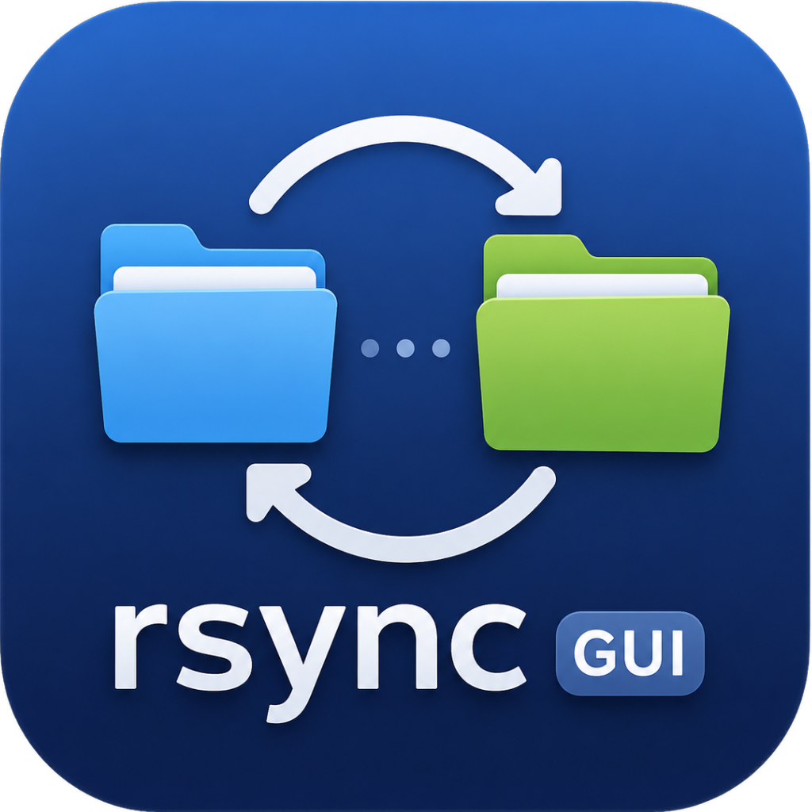

# RsyncGUI

<p align="center">
  
</p>

Interfaz gráfica para `rsync` hecha en Python + Tkinter. Permite copiar carpetas entre directorios locales o hacia/desde un NAS Synology vía SSH, con barra de progreso en tiempo real y tema oscuro nativo.


---

## Características

### Modos de copia
| Modo | Descripción |
|------|-------------|
| 💻 **Local → Local** | Copia entre carpetas del mismo equipo |
| 📤 **Local → NAS** | Envía archivos desde el Mac al NAS Synology por SSH |
| 📥 **NAS → Local** | Descarga archivos del NAS Synology al Mac |

### Explorador de carpetas remoto
Ventana modal que conecta al NAS por SSH y permite navegar el árbol de directorios sin escribir rutas a mano. Soporta tanto clave SSH como contraseña.

### Opciones de rsync configurables
- `--archive` — preserva permisos, fechas, enlaces simbólicos y propietario
- `--verbose` — lista cada archivo copiado
- `--compress` — comprime datos en tránsito (recomendado en NAS)
- `--delete` — elimina en destino los archivos que ya no existen en origen
- `--dry-run` — simulación: muestra qué haría sin copiar nada

### Seguridad y persistencia
- Las **contraseñas se guardan en el Llavero de macOS** (`security` CLI, sin dependencias extra), nunca en texto plano
- Migración automática: si existía una contraseña guardada en el archivo de configuración antiguo, se mueve al Llavero en el primer arranque
- El resto de la configuración (host, usuario, rutas, opciones) persiste en `~/.config/rsyncgui/config.json` entre sesiones

### Interfaz
- Tema oscuro con paleta de color personalizada
- Barra de progreso con contador de archivos (`N / Total archivos — X%`)
- Log en tiempo real via **PTY** (rsync no bufferiza la salida)
- Log con colores: verde para éxito, amarillo para avisos, rojo para errores
- Botón personalizado que evita el tema Aqua de macOS para un aspecto coherente en toda la ventana

---

## Requisitos

- **macOS** (la integración con Keychain requiere el CLI `security`, incluido en el sistema)
- Python 3.8+
- `rsync` instalado en el sistema

```bash
# macOS con Homebrew
brew install rsync
```

> **Icono en el Dock (opcional):** para que aparezca el logo de la app instala PyObjC:
> ```bash
> pip install pyobjc-framework-Cocoa
> ```
> Sin este paquete la app funciona con normalidad pero muestra el icono genérico de Python.

> **Modo NAS con contraseña (opcional):** necesita `sshpass`.
> ```bash
> brew install hudochenkov/sshpass/sshpass
> ```
> La alternativa recomendada es autenticación por clave SSH (sin instalar nada extra).

---

## Instalación

```bash
git clone https://github.com/tu-usuario/rsync-gui.git
cd rsync-gui
python3 rsync_gui.py
```

No requiere dependencias de terceros — sólo la librería estándar de Python.

---

## Uso

```bash
python3 rsync_gui.py
```

### Primer uso con NAS — autenticación por clave SSH (recomendado)

Copia tu clave pública al NAS una sola vez:

```bash
ssh-copy-id -p 22 usuario@ip-del-nas
```

Luego en la app deja el campo **Contraseña** vacío. La conexión usará automáticamente tu clave SSH.

### Uso con contraseña

1. Introduce la contraseña en el campo correspondiente
2. La app la guarda en el **Llavero de macOS** al pulsar **▶ INICIAR COPIA**
3. En la próxima sesión se recupera del Llavero automáticamente

---

## Referencia de campos

| Campo | Descripción |
|-------|-------------|
| **ORIGEN** | Ruta local (botón "Elegir…" abre selector de carpetas) o ruta en el NAS (ej: `/volume1/fotos`) |
| **DESTINO** | Ruta local o remota según el modo seleccionado |
| **Host / IP** | Dirección IP o hostname del NAS Synology |
| **Puerto SSH** | Puerto del servicio SSH del NAS (por defecto `22`) |
| **Usuario** | Usuario del NAS con acceso SSH |
| **Contraseña** | Opcional; se almacena en el Llavero de macOS |

---

## Estructura del proyecto

```
rsync_gui.py       # Aplicación completa (un solo archivo)
logo.png           # Icono de la aplicación
logo.icns          # Icono para bundle macOS (.app)
LICENSE            # MIT
```

---

## Cómo funciona internamente

1. **PTY:** rsync detecta si su salida va a un terminal; sin TTY acumula los datos en buffer. La app abre un pseudo-terminal (`pty.openpty`) para forzar la salida en tiempo real.
2. **Progreso:** se extrae con regex `to-check=N/TOTAL` de la salida de rsync `--progress`.
3. **Keychain:** se usa el CLI estándar de macOS `security add-generic-password` / `find-generic-password` — sin librerías de terceros.
4. **Explorador remoto:** ejecuta `ls -1ap` vía SSH y muestra sólo directorios; navega el árbol en un hilo secundario para no bloquear la UI.

---

## Licencia

[MIT](LICENSE)
